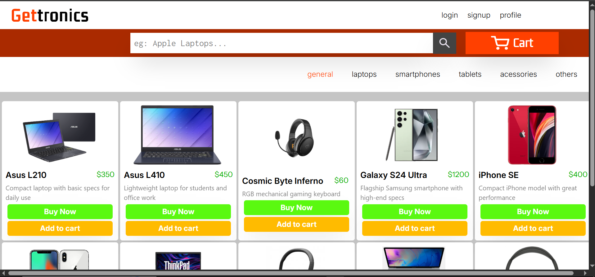
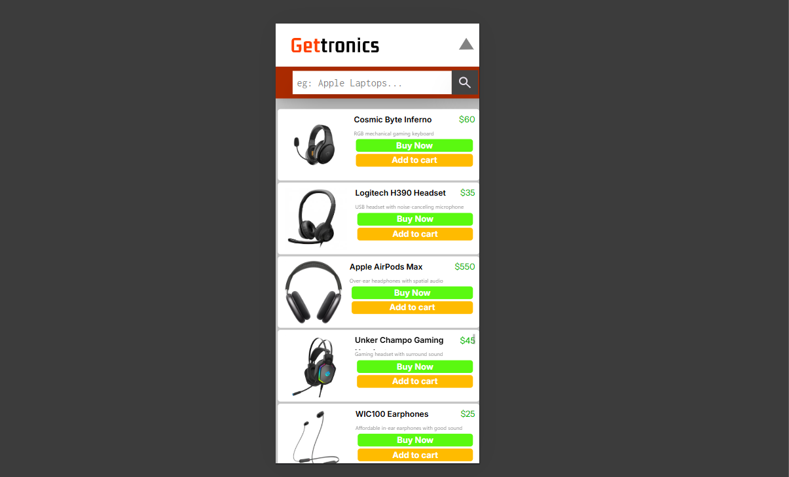
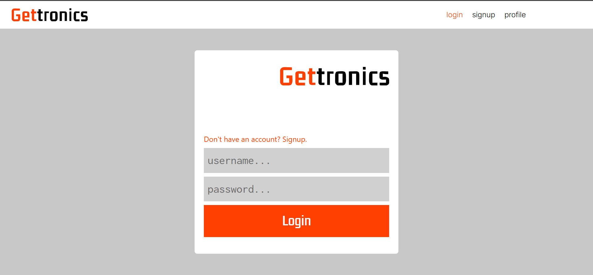

# GetTronics – Full-Stack MERN E-Commerce Project 🙬

**GetTronics** is a full-stack MERN (MongoDB, Express.js, React, Node.js) e-commerce application. It allows users to browse products, manage carts, and place orders, with a clean, responsive UI and secure backend.

This project is a **learning-by-building journey**, featuring modern tools and practices like JWT authentication, Zustand for state management, and Cloudinary for image hosting. It is also a practice of MERN development.

---

## Features

### Backend
- User Authentication & Authorization: Signup, login, JWT-based access control.
- Product Management: Add, update, delete, and fetch products.
- Cart Module: Add, remove, and fetch cart items with real product data.
- Orders Module: Place orders and view order history.
- Database Design: Cart is a weak entity, linked to User and Product.
- Security: Only authenticated users or admins can modify their resources.

### Frontend
- Pages Implemented: Login, Signup, Products page.
- Pages to Implement: Cart feature, Profile page, Product upload from UI.
- State Management: Using Zustand for global state.
- Media Handling: Product images hosted on Cloudinary CDN.
- Responsive Design: UI designed in Figma and implemented in React with responsive components.

---

## Tech Stack
- Frontend: React.js, TailwindCSS, Zustand
- Backend: Node.js, Express.js, MongoDB
- Authentication: JWT, bcrypt
- Image Hosting: Cloudinary CDN
- Database: MongoDB (NoSQL)
- Others: Postman for API testing, Figma for UI design

---

## Project Setup

### Backend
1. Clone the repository:
```bash
git clone https://github.com/Neel2k5/berryshell.git
```
2. Navigate to the backend folder:
```bash
cd backend
```
3. Install dependencies:
```bash
npm install
```
4. Create a `.env` file and add:
```env
MONGO_URI=<your_mongodb_uri>
JWT_SECRET=<your_jwt_secret>
CLOUDINARY_CLOUD_NAME=<your_cloud_name>
CLOUDINARY_API_KEY=<your_cloud_api_key>
CLOUDINARY_API_SECRET=<your_cloud_api_secret>
```
5. Start the server:
```bash
npm run dev
```

### Frontend
1. Navigate to the frontend folder:
```bash
cd frontend
```
2. Install dependencies:
```bash
npm install
```
3. Start the frontend:
```bash
npm start
```

---

## Backend Routes

### User Routes
| Method | Endpoint | Description | Access |
|--------|---------|------------|--------|
| POST | `/user/signup` | Create a new user account | Public |
| POST | `/user/login` | Log in a user and issue JWT in httpOnly cookie | Public |
| GET | `/user/auth/me` | Validate current logged-in user via JWT | Protected |
| GET | `/user/logout` | Log out user and clear JWT cookie | Protected |
| DELETE | `/user/account/delete` | Delete the logged-in user's account after validating credentials | Protected |

### Product Routes
| Method | Endpoint | Description | Access |
|--------|---------|------------|--------|
| GET | `/product/all` | Get all products with optional pagination and filters | Public |
| POST | `/product/new` | Add a new product | Protected (vendor or admin) |
| PATCH | `/product/patch/:productID` | Update an existing product | Protected (vendor or admin) |
| DELETE | `/product/delete/:productID` | Delete a product | Protected (vendor or admin) |
| POST | `/product/new/bulk` | Add multiple products in a single request | Protected (vendor or admin) |

### Cart Routes
| Method | Endpoint | Description | Access |
|--------|---------|------------|--------|
| GET | `/cart` | Get all cart items for a user | Protected (cart owner or admin) |
| POST | `/cart/add` | Add a product to the cart | Protected (cart owner or admin) |
| DELETE | `/cart/remove` | Remove a product from the cart | Protected (cart owner or admin) |

---

## UI Screenshots

### Desktop View


### Mobile View


### Login Page


> The UI is designed in Figma and implemented in React with responsive components. The project uses Zustand for global state management and Cloudinary CDN for product images.

---

## Next Steps
- Implement the Cart UI and link it with backend endpoints.
- Add Profile management.
- Enable product uploads directly from the frontend.
- Add payment integration.
- Dockerize the project for production deployment.

---

## Learning Journey
- Designed UI in Figma and translated it into a React frontend.
- Integrated Zustand for first-time state management across components.
- Integrated Cloudinary CDN for first-time image hosting.

---

## Hashtags
#MERN #FullStackDevelopment #WebDevelopment #ReactJS #NodeJS #ExpressJS #MongoDB #JWT #Zustand #Cloudinary #Frontend #Backend #CRUD #CartModule #OrdersModule #WebDevJourney #LearningByBuilding
